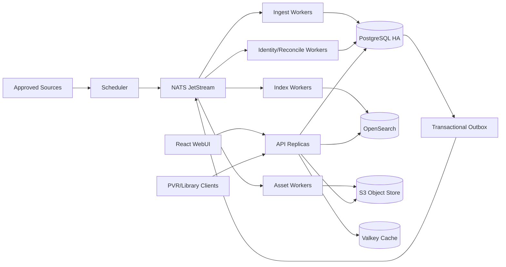
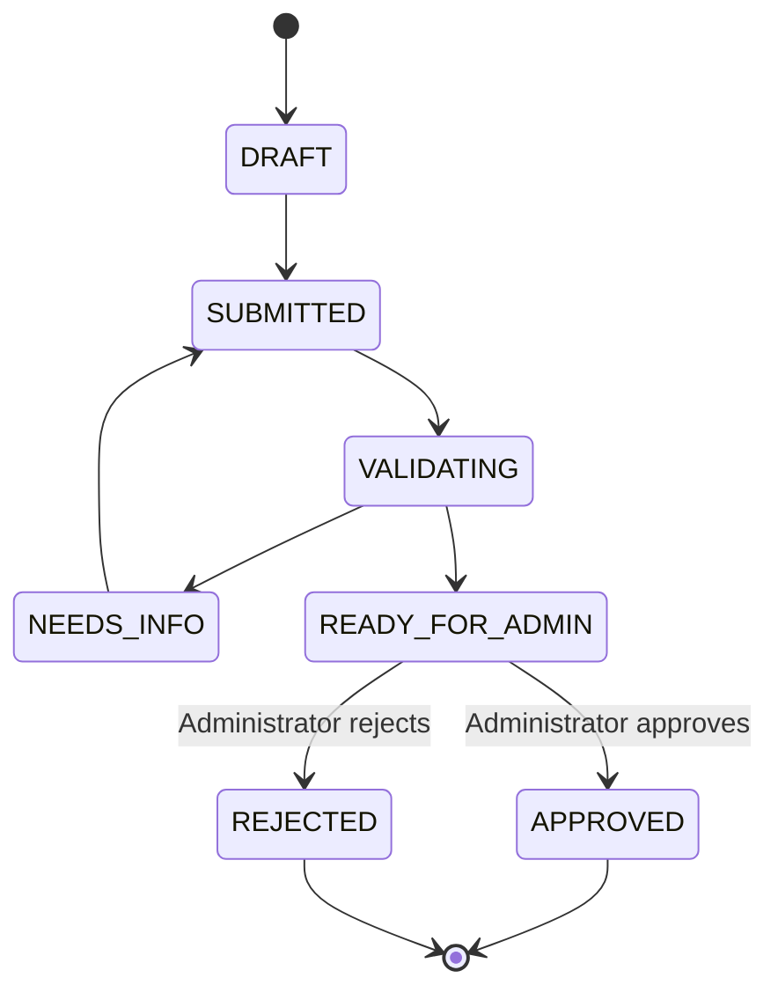
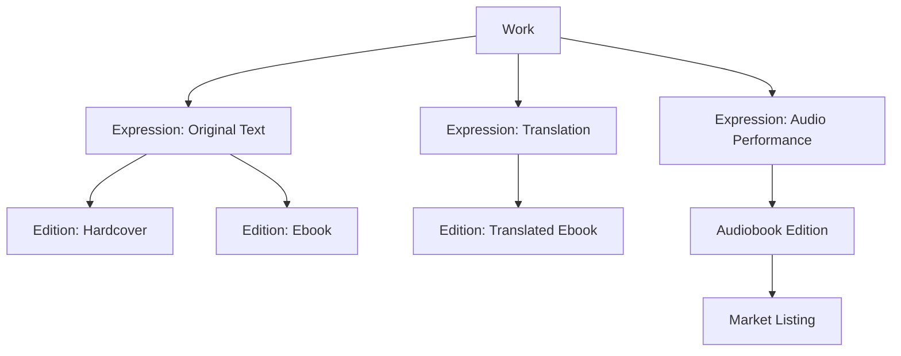
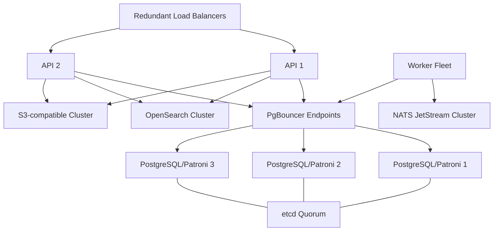

# Architecture Diagrams

## Distributed application

```mermaid
flowchart LR
  SRC[Approved Sources] --> SCH[Scheduler]
  SCH --> NATS[NATS JetStream]
  NATS --> ING[Ingest Workers]
  ING --> PG[(PostgreSQL HA)]
  PG --> OUT[Transactional Outbox]
  OUT --> NATS
  NATS --> REC[Identity/Reconcile Workers]
  REC --> PG
  NATS --> IDX[Index Workers]
  IDX --> OS[(OpenSearch)]
  NATS --> AST[Asset Workers]
  AST --> S3[(S3 Object Store)]
  API[API Replicas] --> PG
  API --> OS
  API --> VK[(Valkey Cache)]
  API --> S3
  WEB[React WebUI] --> API
  PVR[PVR/Library Clients] --> API
```

## User contribution publication

```mermaid
stateDiagram-v2
  [*] --> DRAFT
  DRAFT --> SUBMITTED
  SUBMITTED --> VALIDATING
  VALIDATING --> NEEDS_INFO
  NEEDS_INFO --> SUBMITTED
  VALIDATING --> READY_FOR_ADMIN
  READY_FOR_ADMIN --> REJECTED: Administrator rejects
  READY_FOR_ADMIN --> APPROVED: Administrator approves
  APPROVED --> [*]
  REJECTED --> [*]
```

## Canonical identity

```mermaid
flowchart TD
  W[Work] --> E1[Expression: Original Text]
  W --> E2[Expression: Translation]
  W --> EA[Expression: Audio Performance]
  E1 --> ED1[Edition: Hardcover]
  E1 --> ED2[Edition: Ebook]
  E2 --> ED3[Edition: Translated Ebook]
  EA --> ED4[Audiobook Edition]
  ED4 --> ML[Market Listing]
```

## HA dependencies

```mermaid
flowchart TB
  LB[Redundant Load Balancers]
  LB --> API1[API 1]
  LB --> API2[API 2]
  API1 --> PGB[PgBouncer Endpoints]
  API2 --> PGB
  PGB --> PG1[PostgreSQL/Patroni 1]
  PGB --> PG2[PostgreSQL/Patroni 2]
  PGB --> PG3[PostgreSQL/Patroni 3]
  PG1 --- ETCD[etcd Quorum]
  PG2 --- ETCD
  PG3 --- ETCD
  API1 --> OS[OpenSearch Cluster]
  API2 --> OS
  API1 --> S3[S3-compatible Cluster]
  API2 --> S3
  W[Worker Fleet] --> N[NATS JetStream Cluster]
  W --> PGB
```
