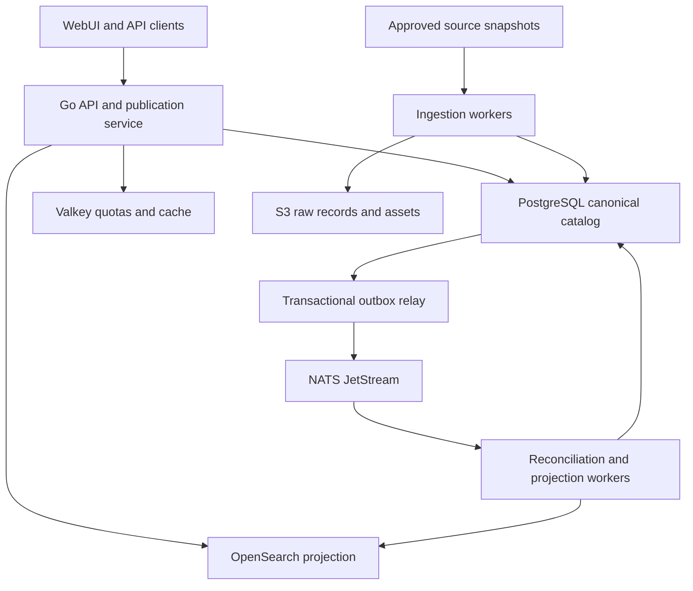

# Architecture and technology decisions

Status: target architecture; preserve existing adapters where useful. See [audit](15-repository-audit.md) for what actually exists.

## Component ownership

This is a data-flow diagram, not a deployment topology. PostgreSQL owns canonical state, identities, proposals, source policies, job state and the outbox. NATS transports durable work. OpenSearch is rebuildable. Valkey contains non-authoritative cache and quota state. S3 contains raw payloads/assets with PostgreSQL manifests, hashes and rights records. No source worker updates public canonical tables directly.

Use a modular Go application and separately runnable API/worker/scheduler processes from one codebase. Avoid independently versioned microservices until a measured need exists. Dependency interfaces belong at external boundaries (database, messaging, search, object store, source HTTP); do not create an interface for every internal function. Distributed behavior must be exercised through the real adapters.

## Retained stack and sequencing

| Layer | Decision | Why / implementation rule |
| --- | --- | --- |
| Backend | Go; actual toolchain from `go.mod` | Retain work already present; standard library HTTP and explicit domain services |
| Web | React + TypeScript + Vite | Keep current installed dependency set during migration; security/compatibility updates get focused PRs |
| UI libraries | TanStack Query/Table where needed; accessible components built with a consistent design system | Avoid paid component tiers; choose and lock actual versions during S2/S5 |
| Database | PostgreSQL 18 family, migrations, PgBouncer | Relational integrity and rich structured claims; runtime DB driver must be wired and tested |
| Jobs/events | NATS JetStream | Already selected; use from first durable source pipeline in S2 |
| Quotas/cache | Valkey | Shared rate limits across API replicas from S1; not a canonical store |
| Search | OpenSearch | Implement searchable projection in S2; mappings/analyzers evolve with regression tests |
| Objects | S3 API; SeaweedFS reference | Vendor-neutral client boundary; verify metadata persistence and credentials in S2/S6 |
| Telemetry | OpenTelemetry, Prometheus/OpenMetrics, structured JSON logs | Correlate source/job/request IDs; never log raw credentials |
| Local deployment | Docker Compose | Reproducible single-host development and standard self-hosted installation |
| HA deployment | Documented three-failure-domain reference using the same containers | PG/Patroni/etcd, NATS quorum, search replicas and redundant S3; demonstrated in S6 |

Do not upgrade React/Vite merely because old prose named a newer major. The inspected package is React 18/Vite 6, while the old README named React 19/Vite 8. Use manifests as the current version authority. Security-supported release pins and compatibility testing are required before GA. Do not invent available image tags or dependency versions.

## Transaction and publication contract

In one PostgreSQL transaction: validate the actor/source policy; lock the affected canonical revision; persist canonical changes plus audit/provenance; append a public change event and outbox entry. Commit before acknowledging externally. The outbox relay retries safely. A consumer records `(consumer_name, event_id)` in its durable inbox in the same transaction as its database effects, then acknowledges JetStream. For OpenSearch, external versioning or equivalent monotonic revision checks prevent an old event from overwriting a newer document.

JetStream can redeliver; application idempotency is required [R18 in the research register](17-references.md). No claim of distributed exactly-once transactions across PostgreSQL, NATS and S3. S3 writes use deterministic keys and hashes; a failed DB commit leaves an unreferenced object that a bounded garbage collector may later remove. Deletion has a grace period and reference check.

## Process contracts

| Process | Responsibilities | Failure behavior |
| --- | --- | --- |
| API | Authentication, validation, canonical reads, commands, quotas, sessions | Bounded timeouts; 503 for required unavailable dependency; no silent unrestricted access |
| Scheduler | Materialize due jobs from durable schedules; record run keys | Unique schedule occurrence key prevents duplicate jobs; bounded missed-run catch-up |
| Ingestion worker | Download/read snapshot, parse, normalize source evidence, checkpoint | Pause/cancel at durable chunk boundaries; malformed records quarantine |
| Reconciliation worker | Resolve identities and compute eligible canonical field revisions | Conflicts create review work; no title-only/person-name-only auto-merge |
| Outbox relay | Publish persisted changes to NATS; retain replay status | At-least-once publish; transient retries with backoff |
| Projection worker | Build search/index/export projections of published catalog | Monotonic version checks, retries, reconciliation/rebuild |
| Asset worker | Fetch allowed assets, inspect bytes, create derivatives | Host allowlist, size/time caps, validation and rights filtering |

One binary may expose subcommands for these processes. The current tree lacks `cmd/bookdb`; S0 must restore a functioning entry point before asserting the Docker image works. Never produce empty placeholder commands that exit successfully without performing their advertised action.

## Dependency and availability rules

Liveness means the process is alive; readiness means required capabilities are usable. A TCP socket probe alone is insufficient for authenticated database readiness. Use query/ping operations with deadlines. Search outage may leave direct UUID/identifier lookup available through PostgreSQL while search returns a clear 503; no hidden provider fallback. An upstream outage must not break existing catalog reads.

The standard profile uses a single service instance for each dependency. It is explicitly not HA. Single-node development settings such as disabled OpenSearch security and fixed development credentials must not be shipped as production defaults. Profiles declare dependencies explicitly; health checks must not require an unused service just because an old config field exists.

Do not introduce a service mesh, custom control plane, agent scheduler, Kubernetes operator or LLM-based metadata engine as a prerequisite. S6 proves deployment on allocated hosts using documented containers and network endpoints; Kubernetes-specific packaging is optional after the reference profile is accepted.

## Physical layout

Keep `internal/`, `web/`, `api/`, `config/`, `deployment/`, `scripts/` and existing tests. Add focused packages for catalog, identifiers, contributions, ingestion, reconciliation, publication and API keys as their slices land. Add `cmd/bookdb/` and test fixtures when implemented. API schemas and client code generation must have one canonical source. Avoid repository-wide renames during governance migration.
