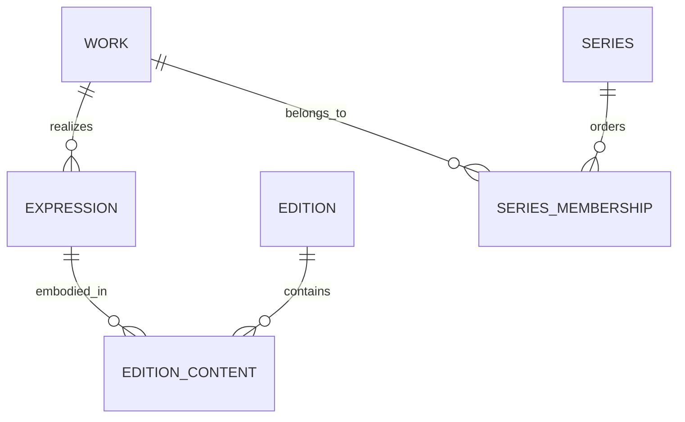

# Canonical data model and identity rules

Status: BookDB domain design. It uses the work/expression/manifestation distinction as conceptual guidance, not a claim of full IFLA LRM conformance [R14](17-references.md). The user-facing word **edition** means a bibliographic publication/manifestation, not an individual file owned by a reader.

## Core entities

| Entity | Meaning | Required invariants |
| --- | --- | --- |
| Work | Intellectual creation, such as a novel or an anthology as an aggregate | Stable UUID; titles are labels, not identifiers |
| Expression | A realization: translation, revision, abridgment or a distinct performance | Linked work; language can be unknown; same title/language does not establish identity |
| Edition | A published manifestation carrying one or more expressions | Publication/format/market metadata; no requirement for ISBN |
| Edition content | Ordered junction between an edition and its expressions/components | Supports omnibus, bilingual and multi-part publications without data duplication |
| Person | A human contributor identity | Multiple names/scripts/pseudonyms; no uniqueness on display name |
| Organization | Publisher, imprint, studio or other credited organization | Parent/imprint relationships and aliases; not stored only as free text |
| Credit | Person/organization + controlled role + target + display order and credited-as text | Targets work, expression, edition or component with enforceable foreign keys |
| Series / membership | Named grouping, possibly nested or with alternative orders | Decimal positions and labels such as prequel; preserve order scheme and evidence |
| Identifier | Namespace, normalized value, raw value, target and evidence/status | ISBN is normally edition-scoped; source IDs include source and entity type |
| Source record / revision | A record as acquired from a named source snapshot/version | Stable source key, hash, acquisition time, source modification time, policy reference |
| Claim | Field assertion with evidence, qualifiers and observation dates | Immutable revisions; do not overwrite raw source history to match canonical output |
| Canonical field selection | Selected claim(s), reason, algorithm version or admin override | Every published value traceable to evidence or approved editorial contribution |
| Proposal / decision | A private suggested change and an administrator's decision | Revision bound; approval cannot be applied to a different proposal revision |
| Asset | Cover, portrait, derivative or metadata attachment | Content hash, entity relation, rights, origin and publication eligibility |
| Change / redirect / tombstone | Durable identity and publication history | IDs never reassigned; merges and splits remain resolvable |

## Relationships

Credits, claims and identifiers attach through typed junctions or an entity registry with foreign-key enforcement. Do not use unchecked `(subject_type, subject_id)` values as the only integrity mechanism. Database constraints protect cardinality and referential integrity; service validation protects domain semantics.

## Metadata dictionary

| Scope | Supported fields |
| --- | --- |
| Work | Canonical/localized/alternative titles, subtitle, sort title, original language(s), original release date with precision, synopsis variants and language, subjects/genres/classifications, audience, content advisories with source, related/adapted works, series memberships |
| Expression | Language/script, translation/revision identity, translated title, abridgment status, text/performance form, source expression, credited translator/narrator/cast/editor, performance/recording dates with precision |
| Edition | Edition statement, publication title, format/media/carrier, digital publication type, publisher/imprint, places/markets, publication dates, ISBNs/other identifiers, extent/page count, dimensions, accessibility characteristics, cover associations, component contents |
| Audio edition | Duration in integer milliseconds when known, abridged/unabridged/unknown, single voice/full cast, narrator credits and credited-as, producer/studio, recording/edition dates, part/track count, distribution format; codec/bitrate only when a source describes that published variant |
| Person | Display/sort names, alternate names, credited names, language/script, pseudonym relationships, authority IDs, birth/death dates with precision, public biography with rights, portrait with rights, contribution graph |
| Organization | Names/aliases, organization kind, parent/imprint relationships, authority IDs, public URLs, relevant places and credited publications |
| Series | Titles/aliases, description, kind, membership positions/order scheme, related series, language/market qualifiers |
| All catalog entities | Stable UUID, canonical revision, publication state, timestamps, provenance links, quality indicators, merge/split history |

Model dates as original text plus normalized value/range and precision (`year`, `month`, `day`, `range`, `unknown`). Never turn a year-only date into an asserted January 1 release. Preserve Unicode NFC display strings and original spelling; store separate search-normalized forms. Keep multilingual labels rather than translating facts automatically. Language and market are different dimensions.

No invented author called “Unknown Author” in the canonical people table. The UI may display an unknown label when a relationship is absent. No fake ISBN, zero runtime as a substitute for missing runtime, inferred nationality, or generated biography. Unknown, not-applicable and withheld are distinct states where needed.

## Format and contributor semantics

An ebook file extension is not automatically a separate intellectual work. A separately published ebook variant can be an edition. Two narrations of the same text must remain distinguishable performances; an abridged recording must not be merged with an unabridged one. A translation belongs to the same work only when evidence supports that relationship. A retelling/adaptation may be a related work. Contributor roles include author, coauthor, translator, narrator, voice actor, editor, illustrator, photographer, foreword/afterword author, producer, director, composer where relevant, publisher and recording studio. Roles are extensible through versioned controlled vocabulary, with source terms retained.

Anthology/omnibus modeling must support contents from multiple works and an aggregate work. Do not force a single `expression_id` to express every publication. Initial migrations may retain a compatibility field during backfill, but the relationship table becomes authoritative before S5.

## Identifier conflict policy

Normalize ISBN-10/13 with checksum validation and retain raw source values. Invalid values remain source evidence but are ineligible for exact automatic matching. An ISBN claim may conflict across upstream records; do not discard one record or force a merge to satisfy a unique constraint. Keep a unique source-record mapping, candidate identifier assertions, and a separately resolved identifier lookup index that can return ambiguity. Canonical UUIDs are independent of ISBN and do not change when a source corrects an identifier.

Person names, title strings, publication years and narrator names are never sufficient unique keys. Source IDs must be namespaced. Duplicate source versions with identical hashes are idempotent no-ops. A source deleting a record does not automatically delete BookDB's canonical entity.

## Forward migrations from the inspected baseline

Do not edit `0001_empty_database.sql` or `0002_canonical_schema_foundation.sql` after application. Add forward migrations and upgrade tests:

1. Add organizations, contributor relationships, aliases, identifiers, edition contents and source-record revisions.
2. Replace `UNIQUE(work_id, language_code, expression_title)` with evidence-based identity; it incorrectly constrains distinct same-language performances.
3. Replace a single unique `editions.isbn13` field as the identity authority with conflict-capable identifier assertions; migrate populated values without losing them.
4. Remove destructive cascade semantics from canonical relationships where they would erase published history; use explicit merge/tombstone operations.
5. Evolve claims to refer to valid source records and subjects, add policy/rules versions, and separate canonical field selection.
6. Add accounts, API keys, revision-bound decisions, inbox/outbox and public change events as the relevant stages land.
7. Add migration checksums and a database migration lock. Test fresh install, upgrade from populated baseline and interrupted migration. Table identifiers must be fixed or safely validated.

The migration package itself does not execute SQL or change application data.
